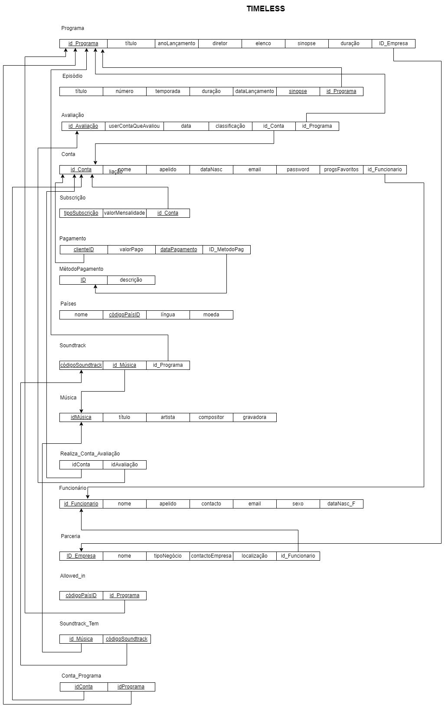

# <t style="color:#0080ff">Gestão de uma plataforma de streaming</t>

# Projeto Base de Dados - **P10G3**
#  Timeless
## Gestão de uma empresa de streaming de desenhos animados/programas televisivos antigos

- Inês Nunes Santos - 103477
- Patrícia Rafela da Rocha Cardoso - 103243

## Análise de Requisitos

Esta base de dados tem como objetivo gerir uma empresa responsável por um serviço streaming de desenhos animados e programas televisivos a partir dos anos 80 que já não se encontram disponíveis atualmente para poderem ser visualizados nos guias de canais de televisão. 

Para além disto, é possível aceder a informações, como por exemplo: utilizadores, planos de subscrição, pagamentos e outros dados relevantes à plataforma. Também é possível realizar análises e consultas sobre o comportamento do utilizador e a popularidade de um determinado programa. Os programas televisivos/desenhos animados são de natureza nostálgica para muitas pessoas e podem ser difíceis de encontrar noutros serviços de streaming. Deste modo, uma das vantagens que esta base de dados traz consigo consistirá na preservação destes para o bem da cultura e da memória coletiva. 

Algumas das funcionalidades proporcionadas aos seus clientes por esta base de dados serão: 

- Pesquisar programas 

- Consultar episódios disponíveis, relativos a um programa 

- Fazer avaliações (pessoais) a programas 

- Gerir a conta e o plano de subscrição 

- Efetuar o pagamento da sua subscrição
 

## Diagrama Entidade-Relacionamento (DER)

Inicialmente, modelámos o projeto tal como está representado no DER seguinte. 

[DER](DiagramaEntidadeRelacionamento_DER_TIMELESS.pdf)

Após uma análise mais cuidada do problema, fizemos algumas alterações ao DER anterior:

- Foi criada uma nova entidade MétodoPagamento, conectada à Entidade Pagamento.
- Foi retirada a Entidade Idiomas.

## Equema Relacional da BD

O esquema relacional está representado na figura seguinte:

# Ficheiros SQL
## SQL DDL - definição da estrutura da BD

### Criação das tabelas

O ficheiro *timeless_createTables.sql* contém o código SQL que permite a criação das tabelas, de acordo com o esquema relacional.

### Drop tables

O ficheiro *drops.sql* contém o código SQL que permite a *eliminação* das tabelas do projeto, por ordem adequada, de acordo com o esquema relacional.

### Inserções

O ficheiro *timeless_insertValues.sql* contém o código SQL que permite a inserção de dados nas tabelas criadas anteriormente.

### Views

O ficheiro *views.sql* contém o código SQL de algumas *views* criadas sobre a base de dados:

 - *ProgramasPopulares*, que permite visualizar os programas melhor avaliados, ou com melhores classificações. É possível calcular a média dessas clasificações (com base nas avaliações dadas pelos utilizadores) para cada programa e classificar os programas com base nessa média.
 - *EpisodiosDoPrograma*, que permite visualizar os episódios de um programa, de determinada temporada.

### Queries

O ficheiro *queries.sql* contém o código SQL de algumas *queries* efetuadas sobre a base de dados:

 - Após a criação da view «ProgramasPopulares», pode-se usar a 1ª query do ficheiro para a consultar, e aplicando-lhe a cláusula ORDER BY para obter os programas ordenados por classificação (do mais para o menos popular).
 - Para consultar a segunda view que foi criada («EpisodiosDoPrograma»), usa-se a segunda e a terceira queries criadas para pesquisar mais rapidamente pelos episódios de um programa. E para especificar/filtrar por determinado programa, ajusta-se a consulta, ao acrescentar na cláusula WHERE o id do programa que pretendemos pesquisar.
- Usar a UDF "ObterTodasParceriasNegociadasFuncionario" numa consulta
- Usar a UDF "ObterSubscricaoAssociadaConta" numa consulta.

### Indexes/Índices

O ficheiro *indexes.sql* contém o código dos *índices* criados sobre a base de dados:

 - *idx_IDCLIENTE_DATAPAGAMENTO* sobre a tabela *TIMELESS_PAGAMENTO* e os atributos *idCliente e dataPagamento*
 - *idx_IDPROGRAMA_TEMPORADA* sobre a tabela *TIMELESS_EPISODIO* e atributos *idprograma e temporada*
 - *idx_conta_programa* sobre a tabela *TIMELESS_CONTA_PROGRAMA* e atributo *idConta*.

### Nota:
Estes índices foram criados, no entanto, não compensa usá-los de facto, visto que não conferem quaisquer melhorias na eficiência das consultas, devido à pouca quantidade de dados inseridos na base de dados. Só iria compensar se, eventualmente, existissem centenas ou milhares de tuplos inseridos na base de dados.

### Triggers

O ficheiro *triggers.sql* contém o código SQL dos *triggers* criados sobre a base de dados:

 - Trigger para calcular a média de avaliações de um programa:
 ao receber uma nova avaliação para um programa, esse trigger pode ser acionado para calcular automaticamente a média das avaliações atribuídas ao programa, atualizando assim o valor da classificação média. Precisamos de criar uma coluna ClassificacaoMedia na tabela TIMELESS_PROGRAMA. Adicionar a coluna classificacaoMedia à tabela TIMELESS_PROGRAMA. Após a criado do trigger, sempre que uma nova avaliação for inserida na tabela TIMELESS_AVALIACAO, o trigger calculará a média das classificações para o programa correspondente e atualizará a coluna classificacaoMedia na tabela TIMELESS_PROGRAMA com o valor calculado.
 - Trigger para atualizar a quantidade de programas num país: Quando um programa é associado a um novo país de exibição, esse trigger pode ser acionado para atualizar automaticamente a contagem de programas disponíveis nesse país (ALTER TABLE TIMELESS_ALLOWEDIN ADD quantidadeProgramas INT;). Quando há uma nova inserção na tabela TIMELESS_ALLOWEDIN, o trigger é acionado e obtém o código do país e o id do programa inserido e atualiza a coluna quantidadeProgramas na tabela TIMELESS_ALLOWEDIN com o número de programas disponíveis nesse país. Preciso de uma nova coluna na tabela TIMELESS_ALLOWEDIN chamada quantidadeProgramas para armazenar a quantidade de programas exibida em um determinado país.
 - Trigger para enviar lembretes de pagamento: Fazer uma simulação do envio de um email para o campo [email] na entidade TIMELESS_CONTA quando o campo [dataPagamento] na entidade TIMELESS_PAGAMENTO estiver a 7 dias ou menos de distância da data atual.
 Duas formas de implementar isto seria enviar um email à pessoa, lembrando-a da data de pagamento, no entanto, os emails que temos na base de dados não são reais. Então, a alternativa que nos pareceu mais correta foi criar uma tabela chamada TIMELESS_LEMBRETES. Afinal de contas, não foi possível criar a entidade TIMELESS_LEMBRETES, porque ela ia estar relacionada com a entidade TIMELESS_PAGAMENTO que é uma entidade fraca. Então, optámos por fazer uma simulação de envio de um email.

### User Defined Functions

O ficheiro *udfs.sql* contém o código SQL de algumas *UDFs* criadas sobre a base de dados:

- Dado um id de um funcionário, devolve todas as parcerias por ele geridas.
- Dado o id de uma Conta, devolve o tipo da Subscrição do utilizador.

### Stored Procedures

O ficheiro *sps.sql* contém o código SQL da *Stored Procedure* criada sobre a base de dados:

- Receber todas as músicas  pertencentes a uma Soundtrack de um Programa.

Na interface de interação com a base de dados, tanto para as UDFs usadas, como para a SP, houve a criação de uma camada de abstração entre a base de dados e as operações que podem pôr em risco a integridade da mesma (operações que interagem diretamente com o conteúdo da base de dados).

### Interface

Interface e formulários de interação construidos em Windows Forms Application, em C#.

Sendo o trabalho a gestão de uma base de dados de uma plataforma que disponibiliza um serviço de streaming, o nosso foco no desenvolvimento no Windows Form foi permitir a interação com a base de dados por parte dos clientes e por parte dos funcionários.

Inicialmente é preciso fazer o login na base de dados através das credenciais do utilizador.

Na próxima tela, deve clicar ou no botão do cliente ou no botão do funcionário. 

Se clicar no funcionário, pode fazer as seguintes ações:
- gerir contas
- gerir parcerias

    - A gestão das contas é feita com uma query à base de dados: 

    string query = "SELECT c.nome FROM TIMELESS_CONTA c " +
                                "INNER JOIN TIMELESS_FUNCIONARIO f ON c.idFuncionario = f.idFuncionario " +
                                "WHERE f.idFuncionario = @idFuncionario";

    - A gestão de parcerias é feita através de uma udf

No caso do cliente é verificado se tem conta na plataforma.
Se tiver conta, pode fazer as seguintes ações: 

    - Consultar o tipo de subscrição
    Implementado com uma udf.

    - Escolher um episódio para assistir
    Implementado com uma query: 
    string query = "SELECT titulo FROM TIMELESS_EPISODIO";

    - Efetuar um pagamento 
    Implementado com um query:
    string insertQuery = "INSERT INTO TIMELESS_PAGAMENTO (idCliente, valorPago, dataPagamento, metodoId) " + "VALUES (@idCliente, @valorPago, @dataPagamento, @metodoId)";

    - Consultar os Programas Populares 
    Implementado com uma view 

    - Ver soundtrack
    Implementado com uma stored procedure

No caso do cliente não ter conta é encaminhado para a tela de criar conta e depois pode fazer as seguintes ações:
    
    - Escolher o tipo de subscrição
    Implementado com uma query:

    string query = "SELECT tiposubscricao FROM TIMELESS_SUBSCRICAO";

    - Consultar os programas disponíveis por país
    Implementado com queries: 

    string query = "SELECT codigoPaisID, nome FROM TIMELESS_PAISES";

    string query = "SELECT p.titulo, p.anolancamento, p.diretor, p.elenco, p.sinopse, p.duracao " +"FROM TIMELESS_PROGRAMA p " +"INNER JOIN TIMELESS_ALLOWEDIN a ON p.idprograma = a.idPrograma " + "WHERE a.codigoPaisID = @codigoPaisID";

    - Consultar os programas populares 
    Implementado com uma view 